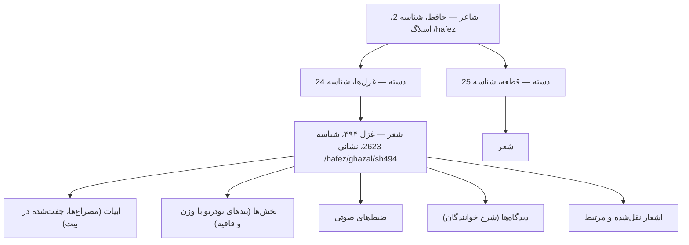

<div align="right">

**فارسی** | [English](README.md)

</div>

# [](https://github.com/ganjoor)

<div align="center">

[](CHANGELOG.md)
[](package.json)
[](LICENSE)

</div>

**سرور Ganjoor MCP** — سرور Model Context Protocol برای API شعر کلاسیک فارسیِ گنجور.

این سرور به یک عامل (agent) اجازه می‌دهد شاعران و مجموعه‌ها را مرور کند، اشعار را همراه با ابیاتشان بخواند،
تحلیل وزن و قافیه انجام دهد، زنجیره‌های «شعر پاسخ» را میان شاعران دنبال کند، ضبط‌های صوتی و شروح را
بیابد و گراف افراد مرتبط و شجره‌نامه‌ها را کاوش کند.

**۴۴ ابزار، دسترسی فقط‌خواندنی. نیازی به کلید API نیست.**

---

## فهرست

- [نصب](#نصب)
- [پیکربندی](#پیکربندی)
- [مفاهیم](#مفاهیم)
- [مرجع ابزارها](#مرجع-ابزارها)
- [قالب‌های پاسخ](#قالبهای-پاسخ)
- [نحوهٔ استفاده](#نحوهٔ-استفاده)
- [معماری](#معماری)
- [توسعه](#توسعه)
- [محدودیت‌های شناخته‌شده](#محدودیت‌های-شناختهشده)
- [ارزیابی](#ارزیابی)
- [مشارکت](#مشارکت)

---

## نصب

نیازمند Node.js نسخهٔ ۱۸٫۱۷ یا بالاتر.

```bash
npm install
npm run build
npm start            # انتقال stdio (پیش‌فرض)
```

### VS Code

به فایل `.vscode/mcp.json` اضافه کنید:

```json
{
  "servers": {
    "ganjoor": {
      "type": "stdio",
      "command": "node",
      "args": ["${workspaceFolder}/dist/index.js"]
    }
  }
}
```

### Claude Desktop / Cursor

به فایل پیکربندی MCP خود اضافه کنید:

```json
{
  "mcpServers": {
    "ganjoor": {
      "command": "node",
      "args": ["/absolute/path/to/ganjoor-mcp/dist/index.js"]
    }
  }
}
```

### HTTP قابل‌جریان (استقرار راه‌دور / اشتراکی)

```bash
HTTP=true PORT=3000 npm start
```

نقطهٔ پایانیِ MCP برابر `POST /mcp` است و `GET /health` وضعیت سرور و سرویس بالادستی را گزارش می‌کند.
انتقال HTTP به‌صورت بی‌حالت اجرا می‌شود (برای هر درخواست یک نمونهٔ تازه از سرور ساخته می‌شود)، بنابراین
به‌صورت افقی مقیاس‌پذیر است. این انتقال به‌طور پیش‌فرض روی `127.0.0.1` گوش می‌دهد و هدر `Origin` را
اعتبارسنجی می‌کند تا جلوی حملات rebinding مبتنی بر DNS گرفته شود؛ اگر به مبدأهای غیر لوپ‌بک نیاز
دارید، متغیر `ALLOWED_ORIGINS` را با کاما مقداردهی کنید.

### MCP Inspector

```bash
npm run inspector
```

---

## پیکربندی

همهٔ تنظیمات متغیرهای محیطی هستند؛ هیچ‌کدام اجباری نیستند.

| متغیر | مقدار پیش‌فرض | کاربرد |
| --- | --- | --- |
| `HTTP` | *(تنظیم‌نشده)* | با `true` کردن، به‌جای stdio روی HTTP قابل‌جریان سرو می‌شود. |
| `PORT` | `3000` | درگاه HTTP. |
| `HOST` | `127.0.0.1` | نشانی اتصال HTTP. |
| `ALLOWED_ORIGINS` | *(خالی)* | مقادیر مجازِ اضافه برای `Origin`، جداشده با کاما. |
| `GANJOOR_API_BASE_URL` | `https://api.ganjoor.net` | نشانی پایهٔ API بالادستی — برای توسعه می‌توانید آن را به یک نمونهٔ محلی RMuseum اشاره دهید. |
| `GANJOOR_SITE_BASE_URL` | `https://ganjoor.net` | نشانی پایهٔ رابط وب که برای ساخت پیوندهای قابل‌کلیک به‌کار می‌رود. |

---

## مفاهیم

مدل دادهٔ گنجور سه سطح تودرتو دارد. درست‌فهمیدن این سه سطح، تفاوت میان یک نشست پربازده و یک نشست
بی‌ثمر برای عامل است.



- **شاعر** — یک مؤلف. حافظ شناسهٔ `2`، سعدی `7`، مولوی `5`، خیام `3` و فردوسی `4` است.
  ابزار `ganjoor_list_poets` یک نام را به شناسه تبدیل می‌کند.
- **دسته** — یک کتاب یا بخش در آثار یک شاعر (CatType برابر `0` عمومی، `1` اشعار، `2` کتاب).
  دستهٔ ریشه‌ای حافظ `9` است و غزل‌های او `24`.
- **شعر** — یک متن، که با یک شناسهٔ عددی و یک اسلاگ نشانی مانند `hafez/ghazal/sh494` شناخته می‌شود.
- **بیت و مصراع** — هر مصراع یک واحد است. دو مصراع پیاپی یک `couplet` می‌سازند (`versePosition`
  برابر ۰ و ۱).

> **اسلاگ‌های نشانی به اسلش آغازین نیاز دارند.** API بالادستی برای `?url=hafez/ghazal/sh494` خطای
> ۴۰۴ برمی‌گرداند، اما `?url=/hafez/ghazal/sh494` را پاسخ می‌دهد. این سرور آن را برای شما یکدست‌سازی
> می‌کند، بنابراین هر دو شکل کار می‌کنند.

> **متن فارسی عیناً بازگردانده می‌شود.** متن راست‌به‌چپ است و برای وزن‌سنجی از اعراب عربی بهره می‌برد.
> مگر آنکه کاربر صریحاً بخواهد، آن را برگردان یا ترجمه نکنید.

---

## مرجع ابزارها

### شاعران و مجموعه‌ها

| ابزار | توضیح |
| --- | --- |
| `ganjoor_list_poets` | همهٔ شاعران منتشرشده همراه با زندگینامه، تاریخ‌ها و مکان‌ها. صفحه‌بندی‌شده. |
| `ganjoor_get_poet` | یک شاعر بر پایهٔ شناسه یا اسلاگ، همراه با زندگینامه و کتاب‌ها/بخش‌های سطح‌بالا. |
| `ganjoor_get_poets_by_century` | همهٔ شاعران، گروه‌بندی‌شده در نیم‌قرن‌های تاریخی. |
| `ganjoor_list_books` | مجموعه‌های نام‌گذاری‌شده، با امکان فیلتر بر اساس شاعر یا زیررشتهٔ نام. |

### دسته‌ها

| ابزار | توضیح |
| --- | --- |
| `ganjoor_get_category` | یک دسته همراه با مسیر راهنما، زیربخش‌ها و اشعار موجود در آن. |
| `ganjoor_list_category_poems` | اشعار یک دسته به‌صورت صفحه‌بندی‌شده، با فیلتر اختیاری عنوان. |
| `ganjoor_get_category_geotags` | مکان‌های جغرافیایی/تاریخی که در زیرشاخهٔ یک دسته برچسب خورده‌اند. |
| `ganjoor_get_category_people_graph` | شبکهٔ افراد پشت زبانهٔ «شخصیت‌ها» یک دسته. |

### اشعار

| ابزار | توضیح |
| --- | --- |
| `ganjoor_search_poems` | جست‌وجوی متن کامل در اشعار، با دامنهٔ شاعر یا دسته. |
| `ganjoor_semantic_search_poems` | جست‌وجوی مبتنی بر معنا («شعری دربارهٔ … پیدا کن»). |
| `ganjoor_get_poem` | یک شعر کامل بر پایهٔ نشانی، با ابیات گروه‌بندی‌شده در قالب بیت. |
| `ganjoor_get_poem_by_id` | همان مورد، بر پایهٔ شناسهٔ عددی. |
| `ganjoor_get_poem_verses` | تنها ابیات — سبک‌تر از دریافت کل شعر. |
| `ganjoor_get_random_poem` | یک شعر تصادفی، در صورت تمایل از یک شاعر خاص. |
| `ganjoor_get_hafez_faal` | یک غزل تصادفی حافظ برای فال فارسی. |
| `ganjoor_get_page_url` | تبدیل هر شناسهٔ صفحه (شعر، دسته، شاعر) به نشانی وب آن. |
| `ganjoor_get_redirect_url` | تبدیل یک نشانی قدیمی گنجور به نشانی فعلی آن. |

### وزن، قافیه و ساختار

| ابزار | توضیح |
| --- | --- |
| `ganjoor_list_rhythms` | همهٔ اوزان عروضی فارسی همراه با شمارش کاربرد. |
| `ganjoor_analyze_poem_rhythm` | تشخیص وزن یک شعر. |
| `ganjoor_analyze_poem_rhyme` | تشخیص حرف و الگوی قافیهٔ یک شعر. |
| `ganjoor_find_similar_poems` | اشعاری با وزن و قافیهٔ یکسان — گراف شعرهای پاسخ. |
| `ganjoor_get_poem_sections` | بخش‌های ساختاری یک شعر (بندها، دوبیتی‌های مثنوی، سه‌مصراعی‌ها). |
| `ganjoor_get_section` | یک بخش همراه با ابیات و بخش‌های مرتبط. |
| `ganjoor_get_related_sections` | بخش‌هایی از اشعار دیگر با همان وزن و قافیه. |
| `ganjoor_get_couplet_sections` | اینکه یک بیت مشخص به کدام بخش‌ها تعلق دارد. |
| `ganjoor_get_language_tagged_sections` | بندهایی که با کد زبانیِ غیر فارسی برچسب خورده‌اند. |

### ضبط‌های صوتی

| ابزار | توضیح |
| --- | --- |
| `ganjoor_search_recitations` | جست‌وجوی ضبط‌ها بر اساس خواننده، شاعر یا دسته. |
| `ganjoor_get_recitation` | یک ضبط همراه با نشانی فایل صوتی. |
| `ganjoor_get_recitation_sync_info` | زمان‌بندی هر مصراع برای هم‌گام‌شدن با صوت. |
| `ganjoor_get_poem_recitations` | همهٔ ضبط‌های منتشرشده برای یک شعر. |
| `ganjoor_get_category_top_recitations` | پرپسنده‌ترین ضبط‌ها در یک دسته. |

### افراد

| ابزار | توضیح |
| --- | --- |
| `ganjoor_list_people` | شخصیت‌های تاریخی و ادبی در گراف دانش گنجور. |
| `ganjoor_get_person` | زندگینامه، تاریخ‌ها و مکان‌های یک شخص. |
| `ganjoor_get_person_poems` | اشعاری که به یک شخص برچسب خورده‌اند. |
| `ganjoor_get_person_relations` | یال‌های خویشاوندی و وابستگی یک شخص. |
| `ganjoor_get_person_family_tree` | کل مؤلفهٔ خویشاوندیِ متصل از یک شخص. |

### شروح، پرسش‌های متداول و مطالب تکمیلی

| ابزار | توضیح |
| --- | --- |
| `ganjoor_get_recent_comments` | تازه‌ترین شروح منتشرشدهٔ خوانندگان. |
| `ganjoor_list_faq_categories` | دسته‌های پرسش‌های متداول تحریریهٔ گنجور. |
| `ganjoor_get_faq_items` | همهٔ پرسش و پاسخ‌های یک دستهٔ متداول. |
| `ganjoor_get_faq_item` | یک پرسش متداول منفرد بر پایهٔ شناسه. |
| `ganjoor_get_poem_images` | تصاویر نسخه‌های خطی و نسخه‌بردار. |
| `ganjoor_get_poem_quoted_poems` | اشعاری که این شعر نقل می‌کند و اشعاری که آن را نقل کرده‌اند. |
| `ganjoor_get_poem_effective_corrections` | سابقهٔ پیش و پسِ اصلاحات متنی از سوی تحریریه. |
| `ganjoor_get_poem_geotags` | مکان‌ها و تاریخ‌های یادبودی که به یک شعر برچسب خورده‌اند. |

همهٔ ابزارها با `readOnlyHint`، `idempotentHint` و `openWorldHint` نشانه‌گذاری شده‌اند و هیچ‌کدام
وضعیت را در گنجور تغییر نمی‌دهند.

---

## قالب‌های پاسخ

هر ابزار یک آرگومان `response_format` می‌گیرد:

- **`markdown`** (پیش‌فرض) — خروجی خوانا با سرتیترها، فهرست‌ها و پیوندهای قابل‌کلیک.
- **`json`** — همان داده‌ها به‌شکل یک شیء ساخت‌یافته که همچنین به‌عنوان `structuredContent` در MCP
  بازگردانده می‌شود تا کلاینت‌های پشتیبان بتوانند فیلدها را مستقیم و بدون تجزیهٔ متن مصرف کنند.

ابزارهای فهرست‌محور یک پوشهٔ صفحه‌بندی یکسان دارند:

```json
{
  "total": 842,
  "count": 20,
  "page": 1,
  "page_size": 20,
  "has_more": true,
  "next_page": 2,
  "poems": [{ "id": 2623, "title": "غزل شمارهٔ ۴۹۴", "full_url": "/hafez/ghazal/sh494" }]
}
```

مقادیر `page` و `page_size` از ۱ شروع می‌شوند؛ `page_size` حداکثر ۱۰۰ است. پاسخ‌هایی که بیش از
۲۵٬۰۰۰ نویسه باشند، به‌جای بریده‌شدن خاموش، با یک پرچم صریح `truncated` کوتاه می‌شوند.

دو نقطهٔ پایانی بالادستی (`/api/ganjoor/poets` و `/api/ganjoor/rhythms`) پارامترهای صفحه‌بندی خود را
نادیده می‌گیرند و همیشه کل مجموعه را برمی‌گردانند. سرور این وضعیت را تشخیص می‌دهد و پنجرهٔ درخواستی
را به‌صورت محلی برش می‌دهد، بنابراین `page` و `has_more` در همهٔ ابزارهای فهرست‌محور درست و سازگار
می‌مانند.

خطاها به‌صورت نتیجهٔ ابزار (نه خطای پروتکل) بازگردانده می‌شوند و پیامی دارند که نقطهٔ پایانی را نام
می‌برد و گام بعدی را پیشنهاد می‌دهد — برای نمونه، خطای ۴۰۴ شما را به `ganjoor_list_poets` راهنمایی
می‌کند تا شناسهٔ معتبری پیدا کنید.

---

## نحوهٔ استفاده

**«حافظ که بود؟»**

```
ganjoor_get_poet { "url": "hafez" }
```

**«غزل ۴۹۴ حافظ را نشانم بده»**

```
ganjoor_get_poem { "url": "hafez/ghazal/sh494", "include_recitations": true }
```

**«کدام اشعار حافظ واژهٔ صبر را دارند؟»**

```
ganjoor_search_poems { "term": "صبر", "poet_id": 2, "page_size": 10 }
```

**«وزن این شعر چیست و چه کسان دیگری در همان وزن سروده‌اند؟»**

```
ganjoor_analyze_poem_rhythm { "poem_id": 2623 }
ganjoor_list_rhythms { "page_size": 100 }
ganjoor_find_similar_poems { "metre": "<rhythm from the previous step>", "page_size": 10 }
```

**«اجداد این شخص چه کسانی بودند؟»**

```
ganjoor_get_person { "person_id": 22 }
ganjoor_get_person_family_tree { "person_id": 22 }
```

**«حافظ دربارهٔ پرسش من چه می‌گوید؟»**

```
ganjoor_get_hafez_faal { }
```

---

## معماری

```
src/
├── index.ts            # نقطهٔ ورود فرایند: stdio یا انتقال HTTP قابل‌جریان
├── server.ts           # createServer() — ثبت همهٔ ابزارها
├── client.ts           # پوشش fetch، نگاشت خطاها، کمک‌کننده‌های صفحه‌بندی
├── types.ts            # اینترفیس‌های TypeScript برای داده‌های گنجور
├── constants.ts        # نشانی‌های پایه، حدود، هویت سرور
├── schemas.ts          # اسکیماهای مشترک Zod (صفحه‌بندی، اسلاگ نشانی، شناسه‌ها)
├── format.ts           # رندر مارک‌داون و کمک‌کننده‌های قالب‌بندی
└── tools/
    ├── registry.ts     # پوشش defineTool(): خطای یکدست + هر دو قالب
    ├── poets.ts        # کشف شاعران
    ├── categories.ts   # مرور دسته‌ها
    ├── poems.ts        # دریافت، جست‌وجو و تبدیل نشانی شعر
    ├── analysis.ts     # وزن، قافیه، بخش‌ها
    ├── audio.ts        # ضبط‌ها
    ├── content.ts      # تصاویر، نقل‌قول‌ها، اصلاحات، برچسب‌های جغرافیایی
    └── people.ts       # گراف افراد، دیدگاه‌ها، پرسش‌های متداول
```

دو قرارداد در سراسر کدبیس جاری است:

- **`defineTool()` هر ثبتی را در بر می‌گیرد.** تضمین می‌کند هر ابزار خطاها را به‌صورت نتیجهٔ
  `isError` با پیام‌های قابل‌اقدام گزارش کند، مارک‌داون یا JSON را یکدست رندر کند و در کنار متن،
  `structuredContent` را هم بازگرداند.
- **`md()` سندها را می‌سازد.** فاصله‌های خالی صریح را حفظ می‌کند تا سرتیترها و فهرست‌های مارک‌داون
  درست از هم جدا شوند، و در عین حال `null` و `false` را حذف می‌کند تا قطعات شرطی به‌درستی محو شوند.

ویژگی‌های غیرمنتظرهٔ سرویس بالادستی در `client.ts` و ماژول‌های ابزار یکدست‌سازی می‌شوند و به
فراخواننده نشت نمی‌کنند — برای نمونه پوشش `{ poet, cat }` در نقطه‌های پایانی دسته، فیلد تودرتوی
`category.cat` در دادهٔ شعر، و الزام اسلش آغازین در پارامترهای نشانی.

---

## توسعه

```bash
npm run build       # کامپایل به dist/
npm run typecheck   # بررسی نوع بدون تولید خروجی
npm test            # آزمون دودِ زنده علیه api.ganjoor.net
npm run inspect     # چاپ خروجی واقعی ابزارها برای بازبینی
npm run clean
```

دستور `npm test` سرور را روی یک انتقال درون‌حافظه‌ای بالا می‌آورد، بررسی می‌کند که هر ابزار توضیحی
قابل‌توجهی دارد، و هر ۴۴ ابزار را علیه API زنده صدا می‌زند و در صورت هر پاسخ خطایی شکست می‌خورد.

---

## محدودیت‌های شناخته‌شده

- **جست‌وجوی معنایی ممکن است غیرفعال باشد.** بک‌اندِ embedding در گنجور اختیاری است؛ وقتی یک استقرار
  آن را خاموش کرده باشد، `ganjoor_semantic_search_poems` خطای ۵۰۳ برمی‌گرداند. ابزار پیام روشنی
  صادر می‌کند و شما را به `ganjoor_search_poems` با یک واژهٔ فارسی هدایت می‌کند.
- **تبدیل نشانی‌های قدیمی پراکنده است.** گنجور فقط برای مسیرهایی که واقعاً تغییر نام داده‌اند
  redirect نگه می‌دارد، بنابراین بیشتر نشانی‌های معتبر به‌جای مقصد، `has_redirect: false`
  برمی‌گردانند.
- **برخی ابزارها همیشه به احراز هویت نیاز دارند.** نقطه‌های پایانیِ پشت حساب کاربری گنجور (نشانک‌ها،
  ارسال دیدگاه، بارگذاری اصلاحیه) عمداً خارج از دامنه‌اند — این سرور فقط‌خواندنی و ناشناس است.
- **فهرست کتاب‌ها گزینش‌شده است.** `ganjoor_list_books` حدود ۱۶۸ مجموعهٔ نام‌گذاری‌شده را پوشش
  می‌دهد و برخی شاعران بزرگ را ندارد — حافظ هیچ مدخلی ندارد. به‌جای آن از `ganjoor_get_poet` با
  `include_cats: true` استفاده کنید؛ این ابزار بخش‌های هر شاعر را مستقیماً از دستهٔ ریشه‌ای او
  می‌خواند.
- **در نقطه‌های پایانی صفحه‌بندی‌شده شمار کل وجود ندارد.** API بالادستی بدون گزارش مجموعه صفحه‌بندی
  می‌کند، بنابراین هرجا نامعلوم باشد `total` حذف می‌شود؛ `has_more` با دریافت یک ردیف فراتر از صفحه
  استنتاج می‌شود.
- **پوشش متن شعر گزینش‌شده است.** برچسب‌گذاری اشخاص، برچسب‌های جغرافیایی و برچسب‌های زبان ذاتاً
  ناقص‌اند — یک نتیجهٔ خالی معمولاً نشانهٔ شکاف پوشش است، نه دلیل نبودن.
- **فیلدهای تاریخ گاهی تقریبی‌اند.** گنجور تاریخ‌هایی را که به آن‌ها مطمئن نیست علامت می‌زند
  (`validBirthDate` / `validDeathDate`)؛ ابزارها این پرچم‌ها را نمایان می‌کنند تا فراخوانندگان بتوانند
  فیلتر کنند.

---

## ارزیابی

فایل `evaluation/evaluation.xml` شامل ۱۰ پرسش فقط‌خواندنی با پاسخ‌های راستی‌آزمایی‌شده است. هر کدام
برای پاسخ‌گویی به چند فراخوانی ابزار نیاز دارد و پیش از ثبت، علیه API زنده بررسی شده است:

```bash
npx tsx tests/verify-evaluation.ts   # همهٔ پرسش‌ها را از مسیر ابزارهای MCP بازپخش می‌کند
```

این پرسش‌ها آگاهانه از پرسش‌های تک‌مرحله‌ایِ trivia پرهیز کرده‌اند. آن‌ها شاعران را با قرن‌ها تلاقی
می‌دهند، گراف خویشاوندی را پیمایش می‌کنند، وزن یک شعر را با فهرست کلی اوزان مقایسه می‌کنند و یک
زنجیرهٔ شعر پاسخ را از راه سوابق نقل‌قول بازمی‌گردانند.

---

## مشارکت

به [CONTRIBUTING.md](CONTRIBUTING.md) و [AGENTS.md](AGENTS.md) نگاه کنید.

---

<div align="right">

**فارسی** | [English](README.md)

</div>