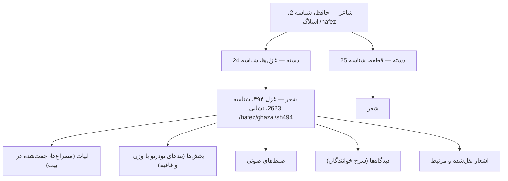

<div align="right">

**فارسی** | [English](README.md)

</div>

# [](https://github.com/ganjoor)

<div align="center">

[](CHANGELOG.md)
[](package.json)
[](LICENSE)

</div>

**سرور Ganjoor MCP**، سرور `Model Context Protocol` برای API گنجور است.
با این سرور، یک عامل می‌تواند شاعران و مجموعه‌های آن را مرور کند، اشعار و ابیات آن‌ها را مطالعه کند،
وزن و قافیه را بررسی کند، ضبط‌های صوتی و شروح را پیدا کند و گراف افراد مرتبط با آن‌ها را بررسی کند.

**۴۴ ابزار در حال حاضر موجود است و همهٔ آن‌ها فقط‌خواندنی هستند؛ برای استفاده به کلید API نیاز نیست.**

---

## فهرست

- [نصب](#نصب)
- [پیکربندی](#پیکربندی)
- [مفاهیم](#مفاهیم)
- [مرجع ابزارها](#مرجع-ابزارها)
- [قالب‌های پاسخ](#قالبهای-پاسخ)
- [نحوهٔ استفاده](#نحوهٔ-استفاده)
- [معماری](#معماری)
- [توسعه](#توسعه)
- [محدودیت‌های شناخته‌شده](#محدودیت‌های-شناختهشده)
- [ارزیابی](#ارزیابی)
- [مشارکت](#مشارکت)

---

## نصب

برای اجرا، Node.js نسخهٔ ۱۸٫۱۷ یا بالاتر نصب باید داشته باشد. پس از نصب وابستگی‌ها، سرور را
با دستورهای زیر اجرا کنید:

```bash
npm install
npm run build
npm start            # انتقال stdio (پیش‌فرض)
```

### VS Code

به فایل `.vscode/mcp.json` اضافه کنید:

```json
{
  "servers": {
    "ganjoor": {
      "type": "stdio",
      "command": "node",
      "args": ["${workspaceFolder}/dist/index.js"]
    }
  }
}
```

### Claude Desktop / Cursor

به فایل پیکربندی MCP خود اضافه کنید:

```json
{
  "mcpServers": {
    "ganjoor": {
      "command": "node",
      "args": ["/absolute/path/to/ganjoor-mcp/dist/index.js"]
    }
  }
}
```

### HTTP قابل‌جریان (استقرار راه‌دور / اشتراکی)

برای اجرای سرور روی HTTP، متغیرهای زیر را در اختیار کنید:

```bash
HTTP=true PORT=3000 npm start
```

نقطهٔ پایانی MCP، `POST /mcp` است و `GET /health` وضعیت سرور و سرویس بالادستی را نمایش می‌دهد.
این انتقال به‌صورت Stateless اجرا می‌شود و برای هر درخواست نمونه‌ای تازه از سرور می‌سازد؛ بنابراین برای
بررسی و تجربهٔ کاربردی مناسب است، اما برای بارهای سنگین مناسب نیست. پیش‌فرضاً سرور روی `127.0.0.1`
گوش می‌دهد و مقدار `Origin` را بررسی می‌کند تا از دریافت درخواست‌های rebinding مبتنی بر DNS جلوگیری کند.
اگر نیاز به دسترسی از مبدأهای غیر محلی داشت، مقدارهای مجاز `Origin` را با کاما از طریق متغیر
`ALLOWED_ORIGINS` مشخص کنید.

### MCP Inspector

```bash
npm run inspector
```

---

## پیکربندی

همهٔ تنظیمات متغیرهای محیطی هستند؛ هیچ‌کدام اجباری نیستند.

| متغیر | مقدار پیش‌فرض | کاربرد |
| --- | --- | --- |
| `HTTP` | *(تنظیم‌نشده)* | با `true` کردن، به‌جای stdio روی HTTP قابل‌جریان سرو می‌شود. |
| `PORT` | `3000` | درگاه HTTP. |
| `HOST` | `127.0.0.1` | نشانی اتصال HTTP. |
| `ALLOWED_ORIGINS` | *(خالی)* | مقادیر مجازِ اضافه برای `Origin`، جداشده با کاما. |
| `GANJOOR_API_BASE_URL` | `https://api.ganjoor.net` | نشانی پایهٔ API بالادستی — برای توسعه می‌توانید آن را به یک نمونهٔ محلی RMuseum اشاره دهید. |
| `GANJOOR_SITE_BASE_URL` | `https://ganjoor.net` | نشانی پایهٔ رابط وب که برای ساخت پیوندهای قابل‌کلیک به‌کار می‌رود. |

---

## مفاهیم

مدل دادهٔ گنجور به سه سطح تودرتو تقسیم می‌شود: شاعر، دسته و شعر. در مسیر مطالعه، شما ابتدا شاعر را
یافت، سپس دسته‌های آن را بررسی می‌کنید و در پایان شعر و ابیات آن را دریافت می‌کنید. شناخت این سه سطح
باعثهٔ استفادهٔ درست از ابزارها و جلوگیری از درخواست‌های نامتوازن برای داده‌های مرتبط است.



- **شاعر** — یک مؤلف در گنجور است؛ برای مثال، حافظ شناسهٔ `2`، سعدی `7`، مولوی `5`، خیام `3`
  و فردوسی `4` دارند. ابزار `ganjoor_list_poets` نام شاعر را به شناسه تبدیل می‌کند.
- **دسته** — کتاب یا بخش از آثار یک شاعر است. مقدار `CatType`، به ترتیب، `0` برای دستهٔ عمومی،
  `1` برای اشعار و `2` برای کتاب است. دستهٔ ریشه‌ای حافظ `9` و دستهٔ غزل‌ها `24` است.
- **شعر** — متن اصلی است و با شناسهٔ عددی و نشانی اسلاگ، مانند `hafez/ghazal/sh494`، قابل تشخیص است.
- **بیت و مصراع** — هر مصراع یک واحد مستقل است. دو مصراع متوالی، یک `couplet` یا بیت را تشکیل می‌دهند و
  مقدار `versePosition` آن‌ها برابر `0` و `1` است.

> **اسلاگ‌های نشانی باید با اسلش آغازین وارد شوند.** API بالادستی برای `?url=hafez/ghazal/sh494`
> خطای ۴۰۴ را بازگردان می‌کند، در حالی که `?url=/hafez/ghazal/sh494` پاسخ می‌دهد. سرور این تفاوت را
> به‌صورت خودکار برای شما حل می‌کند و هر دو شکل را قابل استفاده می‌داند.

> **متن فارسی دقیقاً بازگردانده می‌شود.** این متن راست‌به‌چپ است و برای وزن‌سنجی از اعراب عربی استفاده
> می‌کند. مگر در صورت درخواست صریح، آن را برگردان یا ترجمه نکنید.

---

## مرجع ابزارها

### شاعران و مجموعه‌ها

| ابزار | توضیح |
| --- | --- |
| `ganjoor_list_poets` | نمایش تمام شاعران منتشرشده همراه با زندگینامه، تاریخ‌ها و مکان‌های آن‌ها؛ پاسخ‌ها صفحه‌بندی می‌شوند. |
| `ganjoor_get_poet` | دریافت اطلاعات کامل یک شاعر بر اساس شناسه یا اسلاگ، از جمله زندگینامه و کتاب‌ها یا بخش‌های سطح بالا. |
| `ganjoor_get_poets_by_century` | دریافت تمام شاعران و تفکیک آن‌ها در نیم‌قرن‌های تاریخی. |
| `ganjoor_list_books` | نمایش مجموعه‌های نام‌گذاری‌شده و امکان فیلتر آن‌ها بر اساس شاعر یا نام زیررشته. |

### دسته‌ها

| ابزار | توضیح |
| --- | --- |
| `ganjoor_get_category` | دریافت اطلاعات یک دسته، از جمله مسیر راهنما، زیربخش‌ها و اشعارهای موجود در آن. |
| `ganjoor_list_category_poems` | دریافت اشعارهای یک دسته به‌صورت صفحه‌بندی و امکان فیلتر آن‌ها بر اساس عنوان. |
| `ganjoor_get_category_geotags` | دریافت مکان‌های جغرافیایی یا تاریخی که در زیرشاخهٔ یک دسته برچسب خورده‌اند. |
| `ganjoor_get_category_people_graph` | دریافت شبکهٔ افراد مرتبط با شخصیت‌های یک دسته. |

### اشعار

| ابزار | توضیح |
| --- | --- |
| `ganjoor_search_poems` | جست‌وجو برای پیدا کردن اشعار با متن کامل و محدودیت شاعر یا دسته. |
| `ganjoor_semantic_search_poems` | جست‌وجو با معیار مفهوم، برای مثال «شعری دربارهٔ صبر» و با استفاده از داده‌های معنایی. |
| `ganjoor_get_poem` | دریافت کامل یک شعر بر اساس نشانی، همراه با ابیات آن در قالب بیت. |
| `ganjoor_get_poem_by_id` | دریافت یک شعر بر اساس شناسهٔ عددی آن. |
| `ganjoor_get_poem_verses` | دریافت فقط ابیات یک شعر؛ این گزینه سریع‌تر از دریافت کامل شعر است. |
| `ganjoor_get_random_poem` | دریافت یک شعر تصادفی و در صورت نیاز، محدودیت آن به یک شاعر مشخص. |
| `ganjoor_get_hafez_faal` | دریافت یک غزل تصادفی از حافظ برای اجرای فال فارسی. |
| `ganjoor_get_page_url` | تبدیل شناسهٔ صفحهٔ شعر، دسته یا شاعر به نشانی وب آن. |
| `ganjoor_get_redirect_url` | دریافت نشانی فعلی یک نشانی قدیمی گنجور. |

### وزن، قافیه و ساختار

| ابزار | توضیح |
| --- | --- |
| `ganjoor_list_rhythms` | دریافت تمام اوزان عروضی فارسی همراه با شمارش کاربرد آن‌ها. |
| `ganjoor_analyze_poem_rhythm` | بررسی وزن یک شعر. |
| `ganjoor_analyze_poem_rhyme` | بررسی حرف و الگوی قافیهٔ یک شعر. |
| `ganjoor_find_similar_poems` | پیدا کردن اشعاری با وزن و قافیهٔ یکسان، برای ساختن گراف شعرهای پاسخ. |
| `ganjoor_get_poem_sections` | دریافت بخش‌های ساختاری یک شعر، از جمله بندها، دوبیتی‌های مثنوی و سه‌مصراعی‌ها. |
| `ganjoor_get_section` | دریافت اطلاعات یک بخش همراه با ابیات و بخش‌های مرتبط با آن. |
| `ganjoor_get_related_sections` | دریافت بخش‌هایی از اشعارهای دیگر با همان وزن و قافیه. |
| `ganjoor_get_couplet_sections` | دریافت بخش‌هایی که یک بیت مشخص به آن‌ها تعلق دارد. |
| `ganjoor_get_language_tagged_sections` | دریافت بندهایی که با کد زبانیِ غیر فارسی برچسب خورده‌اند. |

### ضبط‌های صوتی

| ابزار | توضیح |
| --- | --- |
| `ganjoor_search_recitations` | جست‌وجو برای پیدا کردن ضبط‌ها بر اساس خواننده، شاعر یا دسته. |
| `ganjoor_get_recitation` | دریافت اطلاعات یک ضبط همراه با نشانی فایل صوتی آن. |
| `ganjoor_get_recitation_sync_info` | دریافت زمان‌بندی هر مصراع برای هماهنگ‌سازی آن با صوت. |
| `ganjoor_get_poem_recitations` | دریافت تمام ضبط‌های منتشرشده برای یک شعر. |
| `ganjoor_get_category_top_recitations` | دریافت پرپسنده‌ترین ضبط‌ها در یک دسته. |

### افراد

| ابزار | توضیح |
| --- | --- |
| `ganjoor_list_people` | دریافت شخصیت‌های تاریخی و ادبی موجود در گراف دانش گنجور. |
| `ganjoor_get_person` | دریافت زندگینامه، تاریخ‌ها و مکان‌های یک شخص. |
| `ganjoor_get_person_poems` | دریافت اشعاری که به یک شخص برچسب خورده‌اند. |
| `ganjoor_get_person_relations` | دریافت روابط خویشاوندی و وابستگی یک شخص. |
| `ganjoor_get_person_family_tree` | دریافت کامل مؤلفهٔ خویشاوندی متصل از یک شخص. |

### شروح، پرسش‌های متداول و مطالب تکمیلی

| ابزار | توضیح |
| --- | --- |
| `ganjoor_get_recent_comments` | دریافت شروح‌های جدید منتشرشده توسط خوانندگان. |
| `ganjoor_list_faq_categories` | دریافت دسته‌های پرسش‌های متداول از بخش تحریریهٔ گنجور. |
| `ganjoor_get_faq_items` | دریافت کامل پرسش‌ها و پاسخ‌های یک دستهٔ متداول. |
| `ganjoor_get_faq_item` | دریافت یک پرسش متداول منفرد بر اساس شناسه آن. |
| `ganjoor_get_poem_images` | دریافت تصاویر نسخه‌های خطی و نسخه‌بردار یک شعر. |
| `ganjoor_get_poem_quoted_poems` | دریافت اشعاری که این شعر را نقل کرده‌اند و اشعاری که آن را نقل کرده‌اند. |
| `ganjoor_get_poem_effective_corrections` | دریافت تاریخچهٔ اصلاحات پیش و پس از یک شعر،با توجه به تغییرات انجام‌شده توسط تحریریه. |
| `ganjoor_get_poem_geotags` | دریافت مکان‌ها و تاریخ‌های یادبودی که به یک شعر برچسب خورده‌اند. |

همهٔ ابزارها با `readOnlyHint`، `idempotentHint` و `openWorldHint` نشانه‌گذاری شده‌اند و هیچ‌کدام
وضعیت آن‌ها در گنجور تغییر نمی‌کند.

---

## قالب‌های پاسخ

هر ابزار آرگومان `response_format` را می‌گیرد. این آرگومان نوع بازگشت داده را مشخص می‌کند:

- **`markdown`** (پیش‌فرض) — پاسخ خوانایی با سرتیترها، فهرست‌ها و پیوندهای قابل‌کلیک است.
- **`json`** — پاسخ به‌صورت یک شیء ساخت‌یافته بازگردانده می‌شود و در کنار آن، به‌عنوان
  `structuredContent`، برای مصرف مستقیم توسط مشتریان MCP در دسترس است.

ابزارهای فهرست‌محور یک ساختار صفحه‌بندی یکسان دارند:

```json
{
  "total": 842,
  "count": 20,
  "page": 1,
  "page_size": 20,
  "has_more": true,
  "next_page": 2,
  "poems": [{ "id": 2623, "title": "غزل شمارهٔ ۴۹۴", "full_url": "/hafez/ghazal/sh494" }]
}
```

مقادیر `page` و `page_size` از ۱ شروع می‌شوند و حداکی `page_size` ۱۰۰ است. اگر پاسخ بیش از
۲۵٬۰۰۰ نویسه داشته باشد، سرور آن را با یک پرچم صریح `truncated` کوتاه می‌کند، به‌جای اینکه آن را
خاموش اجرا کند.

دو نقطهٔ پایینی API (`/api/ganjoor/poets` و `/api/ganjoor/rhythms`) پارامترهای صفحه‌بندی را نادیده
می‌گیرند و کامل مجموعه را برمی‌گردانند. سرور این وضعیت را تشخیص می‌دهد و درخواستی را با یک پنجرهٔ محلی
برش می‌دهد، بنابراین در همهٔ ابزارهای فهرست‌محور، مقادیر `page` و `has_more` درست و سازگار هستند.

خطاها به‌صورت نتیجهٔ ابزار، نه خطای پروتکل، بازگردانده می‌شوند. پیام خطا نام نقطهٔ پایینی و گام
بعدی را مشخص می‌کند؛ برای مثال، خطای ۴۰۴ شما را به `ganjoor_list_poets` راهنمایی می‌کند تا شناسهٔ
معتبری پیدا کنید.

---

## نحوهٔ استفاده

مثلاً، برای دریافت اطلاعات شاعر حافظ، از ابزار زیر استفاده کنید:

```text
ganjoor_get_poet { "url": "hafez" }
```

برای دریافت غزل ۴۹۴ حافظ، همراه با ضبط‌های آن، از ابزار زیر استفاده کنید:

```text
ganjoor_get_poem { "url": "hafez/ghazal/sh494", "include_recitations": true }
```

برای پیدا کردن اشعار حافظ که واژهٔ «صبر» را دارند، از ابزار جست‌وجو استفاده کنید:

```text
ganjoor_search_poems { "term": "صبر", "poet_id": 2, "page_size": 10 }
```

برای بررسی وزن یک شعر و پیدا کردن اشعاری با همان وزن، مراحل زیر را در ترتیب اجرا کنید:

```text
ganjoor_analyze_poem_rhythm { "poem_id": 2623 }
ganjoor_list_rhythms { "page_size": 100 }
ganjoor_find_similar_poems { "metre": "<rhythm from the previous step>", "page_size": 10 }
```

برای دریافت اطلاعات یک شخص و درخت خویشاوندی آن، از ابزارهای زیر استفاده کنید:

```text
ganjoor_get_person { "person_id": 22 }
ganjoor_get_person_family_tree { "person_id": 22 }
```

برای دریافت یک غزل تصادفی از حافظ، ابزار زیر را اجرا کنید:

```text
ganjoor_get_hafez_faal { }
```

---

## معماری

```
src/
├── index.ts            # نقطهٔ ورود فرایند: stdio یا انتقال HTTP قابل‌جریان
├── server.ts           # createServer() — ثبت همهٔ ابزارها
├── client.ts           # پوشش fetch، نگاشت خطاها، کمک‌کننده‌های صفحه‌بندی
├── types.ts            # اینترفیس‌های TypeScript برای داده‌های گنجور
├── constants.ts        # نشانی‌های پایه، حدود، هویت سرور
├── schemas.ts          # اسکیماهای مشترک Zod (صفحه‌بندی، اسلاگ نشانی، شناسه‌ها)
├── format.ts           # رندر مارک‌داون و کمک‌کننده‌های قالب‌بندی
└── tools/
    ├── registry.ts     # پوشش defineTool(): خطای یکدست + هر دو قالب
    ├── poets.ts        # کشف شاعران
    ├── categories.ts   # مرور دسته‌ها
    ├── poems.ts        # دریافت، جست‌وجو و تبدیل نشانی شعر
    ├── analysis.ts     # وزن، قافیه، بخش‌ها
    ├── audio.ts        # ضبط‌ها
    ├── content.ts      # تصاویر، نقل‌قول‌ها، اصلاحات، برچسب‌های جغرافیایی
    └── people.ts       # گراف افراد، دیدگاه‌ها، پرسش‌های متداول
```

دو قرارداد اصلی در کدبیس وجود دارد:

- **`defineTool()`** هر ابزار را ثبت می‌کند و خطاها را به‌صورت نتیجهٔ `isError` با پیام قابل‌توجه گزارش
  می‌دهد. این قرارداد همچنین پاسخ‌های مارک‌داون و JSON را یکدست می‌راند و `structuredContent` را همراه
  با متن بازگردان می‌دهد.
- **`md()`** اسناد را می‌سازد و فاصله‌های خالی را حفظ می‌کند تا سرتیترها و فهرست‌های مارک‌داون درست
  از هم جدا شوند. این تابع همچنین مقادیر `null` و `false` را از بخش‌های شرطی حذف می‌کند تا پاسخ‌ها
  واضح و قابل‌فهم باشند.

ویژگی‌های غیرمنتظرهٔ سرویس بالادستی در `client.ts` و ماژول‌های ابزار یکدست‌سازی می‌شوند و به
فراخواننده نشت نمی‌کنند. برای نمونه، پوشش `{ poet, cat }` در نقاط پایینی دسته، فیلد تودرتویی
`category.cat` در دادهٔ شعر و الزامی اسلش آغازین در پارامترهای نشانی.

---

## توسعه

```bash
npm run build       # کامپایل به dist/
npm run typecheck   # بررسی نوع بدون تولید خروجی
npm test            # آزمون دودِ زنده علیه api.ganjoor.net
npm run inspect     # چاپ خروجی واقعی ابزارها برای بازبینی
npm run clean
```

دستور `npm test` سرور را روی یک انتقال درون‌حافظه‌ای بالا می‌آورد، بررسی می‌کند که هر ابزار توضیحی
قابل‌توجهی دارد و هر ۴۴ ابزار را علیه API زنده صدا می‌زند. در صورت دریافت پاسخ خطا، آزمون شکست می‌خورد.

---

## محدودیت‌های شناخته‌شده

- **جست‌وجوی معنایی ممکن است غیرفعال باشد.** پشتوانهٔ embedding در گنجور اختیاری است. زمانی که این
  بخش خاموش باشد، `ganjoor_semantic_search_poems` خطای ۵۰۳ را برمی‌گرداند. ابزار پیام روشنی را صادر می‌کند
  و شما را به `ganjoor_search_poems` با یک واژهٔ فارسی هدایت می‌کند.
- **تبدیل نشانی‌های قدیمی پراکنده است.** گنجور فقط برای مسیرهایی که واقعاً تغییر نام داده‌اند
  redirect نگه می‌دارد، بنابراین بیشتر نشانی‌های معتبر به‌جای مقصد، `has_redirect: false`
  برمی‌گردانند.
- **برخی ابزارها همیشه به احراز هویت نیاز دارند.** نقطه‌های پایانیِ پشت حساب کاربری گنجور (نشانک‌ها،
  ارسال دیدگاه، بارگذاری اصلاحیه) عمداً خارج از دامنه‌اند — این سرور فقط‌خواندنی و ناشناس است.
- **فهرست کتاب‌ها گزینش‌شده است.** `ganjoor_list_books` حدود ۱۶۸ مجموعهٔ نام‌گذاری‌شده را پوشش
  می‌دهد و برخی شاعران بزرگ را ندارد — حافظ هیچ مدخلی ندارد. به‌جای آن از `ganjoor_get_poet` با
  `include_cats: true` استفاده کنید؛ این ابزار بخش‌های هر شاعر را مستقیماً از دستهٔ ریشه‌ای او
  می‌خواند.
- **در نقطه‌های پایانی صفحه‌بندی‌شده شمار کل وجود ندارد.** API بالادستی بدون گزارش مجموعه صفحه‌بندی
  می‌کند، بنابراین هرجا نامعلوم باشد `total` حذف می‌شود؛ `has_more` با دریافت یک ردیف فراتر از صفحه
  استنتاج می‌شود.
- **پوشش متن شعر گزینش‌شده است.** برچسب‌گذاری اشخاص، برچسب‌های جغرافیایی و برچسب‌های زبان ذاتاً
  ناقص‌اند — یک نتیجهٔ خالی معمولاً نشانهٔ شکاف پوشش است، نه دلیل نبودن.
- **فیلدهای تاریخ گاهی تقریبی‌اند.** گنجور تاریخ‌هایی را که به آن‌ها مطمئن نیست علامت می‌زند
  (`validBirthDate` / `validDeathDate`)؛ ابزارها این پرچم‌ها را نمایان می‌کنند تا فراخوانندگان بتوانند
  فیلتر کنند.

---

## ارزیابی

فایل `evaluation/evaluation.xml` شامل ۱۰ پرسش فقط‌خواندنی با پاسخ‌های واقعی و آزمایی‌شده است.
هر پرسش برای پاسخ‌گویی به چند فراخوانی ابزار نیاز دارد و پیش از ثبت، علیه API زنده بررسی می‌شود:

```bash
npx tsx tests/verify-evaluation.ts   # اجرای پرسش‌ها از طریق ابزارهای MCP
```

این پرسش‌ها از پاسخ‌های تک‌مرحله‌ای و مبتنی بر حقایق trivial دوری می‌کنند. آن‌ها شاعرها را با قرن‌ها
مرتبط می‌دهند، گراف خویشاوندی را پیمایش می‌کنند، وزن یک شعر را با فهرست کلی اوزان مقایسه می‌کنند و
زنجیرهٔ شعرهای پاسخ را از طریق نقل‌قول‌های قبلی بازمی‌گردانند.

---

## مشارکت

به [CONTRIBUTING.md](CONTRIBUTING.md) و [AGENTS.md](AGENTS.md) نگاه کنید.

---

<div align="right">

**فارسی** | [English](README.md)

</div>