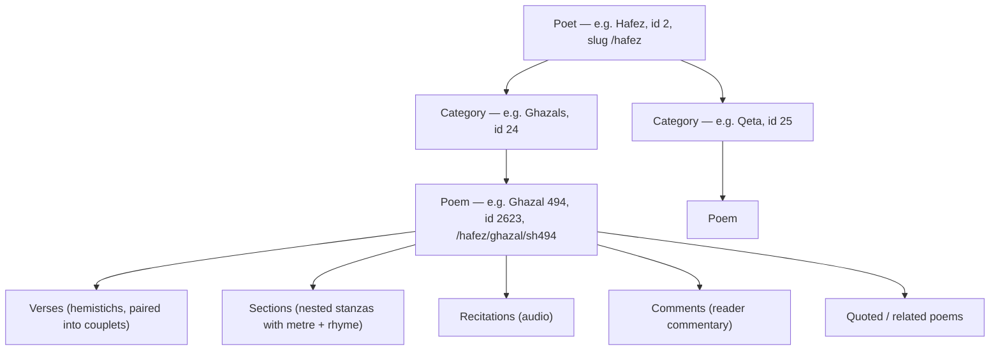

# [](https://github.com/ganjoor)

<div align="center">

[](CHANGELOG.md)
[](package.json)
[](LICENSE)

</div>

<div align="center">

**English** | [فارسی](README.fa.md)

</div>

**Ganjoor MCP Server** — the Model Context Protocol server for the Ganjoor Persian poetry API.

It lets an agent browse poets and collections, read poems with their verses, run prosody and rhyme
analysis, trace reply-poems across poets, look up recitations and commentary, and explore the
related-people and family-tree graphs.

**44 tools, read-only access. No API key required.**

---

## Contents

- [Install](#install)
- [Docker](#docker)
- [Configuration](#configuration)
- [Concepts](#concepts)
- [Tool reference](#tool-reference)
- [Response formats](#response-formats)
- [Usage](#usage)
- [Architecture](#architecture)
- [Development](#development)
- [Known limitations](#known-limitations)
- [Contributing](#contributing)

---

## Install

Requires Node.js 18.17 or newer.

```bash
npm install
npm run build
npm start            # stdio transport (default)
```

### VS Code

Add to `.vscode/mcp.json`:

```json
{
  "servers": {
    "ganjoor": {
      "type": "stdio",
      "command": "node",
      "args": ["${workspaceFolder}/dist/index.js"]
    }
  }
}
```

### Claude Desktop / Cursor

Add to your MCP config file:

```json
{
  "mcpServers": {
    "ganjoor": {
      "command": "node",
      "args": ["/absolute/path/to/ganjoor-mcp/dist/index.js"]
    }
  }
}
```

### Streamable HTTP (remote / shared deployment)

```bash
HTTP=true PORT=3000 npm start
```

The MCP endpoint is `POST /mcp`, and `GET /health` reports server and upstream status. The HTTP
transport runs statelessly (a fresh server instance per request), so it scales horizontally. It binds
`127.0.0.1` by default and validates the `Origin` header to block DNS-rebinding attacks; set
`ALLOWED_ORIGINS` (comma-separated) if you need non-loopback origins.

### MCP Inspector

```bash
npm run inspector
```

---

## Docker

A multi-stage `Dockerfile` and a `docker-compose.yml` are included. The image is built on
`node:22-alpine` and contains only the compiled output and production dependencies.

```bash
docker compose up --build
```

The compose file starts the server in **streamable HTTP mode** on `http://localhost:3000/mcp`, with
`GET /health` reporting server and upstream status. `HOST` is set to `0.0.0.0` so the published port
is reachable from the host; every configuration variable from the table below works as an ordinary
environment variable. To run a single container without compose:

```bash
docker build -t ganjoor-mcp .
docker run --rm -p 3000:3000 -e HTTP=true -e HOST=0.0.0.0 ganjoor-mcp
```

### stdio transport over Docker

Clients that launch the server themselves (rather than connecting over HTTP) can use the `stdio`
profile, which opens stdin for the protocol stream and starts no HTTP listener:

```bash
docker compose --profile stdio run --rm ganjoor-mcp-stdio
```

### With Claude Desktop

To run the server through Docker instead of a local Node install:

```json
{
  "mcpServers": {
    "ganjoor": {
      "command": "docker",
      "args": ["run", "--rm", "-i", "ganjoor-mcp"]
    }
  }
}
```

---

## Configuration

All settings are environment variables; none are required.

| Variable | Default | Purpose |
| --- | --- | --- |
| `HTTP` | *(unset)* | Set to `true` to serve streamable HTTP instead of stdio. |
| `PORT` | `3000` | HTTP port. |
| `HOST` | `127.0.0.1` | HTTP bind address. |
| `ALLOWED_ORIGINS` | *(empty)* | Extra allowed `Origin` values, comma-separated. |
| `GANJOOR_API_BASE_URL` | `https://api.ganjoor.net` | Upstream API base URL — point at a local RMuseum instance for development. |
| `GANJOOR_SITE_BASE_URL` | `https://ganjoor.net` | Front-end base used to build clickable links. |

---

## Concepts

Ganjoor's data model has three nested levels. Getting these straight is the difference between a
productive and a fruitless agent session.



- **Poet** — an author. Hafez is poet id `2`, Saadi `7`, Rumi `5`, Khayyam `3`, Ferdowsi `4`.
  `ganjoor_list_poets` resolves a name to an id.
- **Category** — a book or section inside a poet's work (CatType `0` general, `1` poems, `2` book).
  Hafez's root category is `9`; his ghazals are `24`.
- **Poem** — one text, identified by a numeric id and a URL slug such as `hafez/ghazal/sh494`.
- **Verse** — a hemistich. Two consecutive verses form a `couplet` (`versePosition` 0 and 1).

> **URL slugs need a leading slash.** The upstream API returns 404 for `?url=hafez/ghazal/sh494` but
> resolves `?url=/hafez/ghazal/sh494`. This server normalizes for you, so either form works.

> **Persian text is returned verbatim.** It is right-to-left with Arabic-script diacritics used for
   prosody. Do not transliterate or translate it unless the user explicitly asks.

---

## Tool reference

### Poets and collections

| Tool | Description |
| --- | --- |
| `ganjoor_list_poets` | All published poets with biography, dates, places. Paginated. |
| `ganjoor_get_poet` | One poet by id or slug, with biography and top-level books/sections. |
| `ganjoor_get_poets_by_century` | Every poet grouped into historical half-centuries. |
| `ganjoor_list_books` | Named collections, filterable by poet or name substring. |

### Categories

| Tool | Description |
| --- | --- |
| `ganjoor_get_category` | A category with breadcrumb, sub-sections, and contained poems. |
| `ganjoor_list_category_poems` | Paginated poems in a category, with optional title filter. |
| `ganjoor_get_category_geotags` | Geographic/historical places tagged under a category's subtree. |
| `ganjoor_get_category_people_graph` | People network behind a category's "characters" tab. |

### Poems

| Tool | Description |
| --- | --- |
| `ganjoor_search_poems` | Full-text search across poems, scoped by poet or category. |
| `ganjoor_semantic_search_poems` | Meaning-based search ("find a poem about…"). |
| `ganjoor_get_poem` | A complete poem by URL, with verses grouped into couplets. |
| `ganjoor_get_poem_by_id` | The same, by numeric id. |
| `ganjoor_get_poem_verses` | Just the verses — lighter than fetching the whole poem. |
| `ganjoor_get_random_poem` | A random poem, optionally from one poet. |
| `ganjoor_get_hafez_faal` | A random Hafez ghazal for Persian divination. |
| `ganjoor_get_page_url` | Resolve any page id (poem, category, poet) to its web URL. |
| `ganjoor_get_redirect_url` | Resolve a legacy Ganjoor URL to its current address. |

### Prosody, rhyme, and structure

| Tool | Description |
| --- | --- |
| `ganjoor_list_rhythms` | All Persian prosodic metres with usage counts. |
| `ganjoor_analyze_poem_rhythm` | Detect a poem's metre. |
| `ganjoor_analyze_poem_rhyme` | Detect a poem's rhyme letter and pattern. |
| `ganjoor_find_similar_poems` | Poems sharing a metre and rhyme — the reply-poem graph. |
| `ganjoor_get_poem_sections` | A poem's structural sections (bonds, masnavi bands, tercets). |
| `ganjoor_get_section` | One section with verses and related sections. |
| `ganjoor_get_related_sections` | Sections from other poems matching this one's metre and rhyme. |
| `ganjoor_get_couplet_sections` | Which sections a given couplet belongs to. |
| `ganjoor_get_language_tagged_sections` | Stanzas tagged with a non-Persian language code. |

### Audio recitations

| Tool | Description |
| --- | --- |
| `ganjoor_search_recitations` | Search recitations by reciter, poet, or category. |
| `ganjoor_get_recitation` | One recitation with its audio URL. |
| `ganjoor_get_recitation_sync_info` | Per-verse timing for following along with audio. |
| `ganjoor_get_poem_recitations` | Every recitation published for one poem. |
| `ganjoor_get_category_top_recitations` | Most-upvoted recitations within a category. |

### People

| Tool | Description |
| --- | --- |
| `ganjoor_list_people` | Historical and literary figures in Ganjoor's knowledge graph. |
| `ganjoor_get_person` | One person's biography, dates, and places. |
| `ganjoor_get_person_poems` | Poems tagged with a person. |
| `ganjoor_get_person_relations` | A person's kinship and affiliation edges. |
| `ganjoor_get_person_family_tree` | The whole connected kinship component from one person. |

### Commentary, FAQ, and supplementary material

| Tool | Description |
| --- | --- |
| `ganjoor_get_recent_comments` | Recent published reader commentary. |
| `ganjoor_list_faq_categories` | Ganjoor's editorial FAQ categories. |
| `ganjoor_get_faq_items` | All Q&A entries in one FAQ category. |
| `ganjoor_get_faq_item` | A single FAQ entry by id. |
| `ganjoor_get_poem_images` | Manuscript and facsimile images. |
| `ganjoor_get_poem_quoted_poems` | Poems this one quotes, and poems quoting it. |
| `ganjoor_get_poem_effective_corrections` | The editorial before/after record of text corrections. |
| `ganjoor_get_poem_geotags` | Places and commemorative dates tagged to one poem. |

Every tool is annotated `readOnlyHint`, `idempotentHint`, and `openWorldHint`, and none of them
modify state on Ganjoor.

---

## Response formats

Every tool takes a `response_format` argument:

- **`markdown`** (default) — human-readable output with headers, lists, and clickable links.
- **`json`** — the same data as a structured object, also returned as MCP `structuredContent` so
  clients that support it can consume fields directly without parsing text.

List tools share a consistent pagination envelope:

```json
{
  "total": 842,
  "count": 20,
  "page": 1,
  "page_size": 20,
  "has_more": true,
  "next_page": 2,
  "poems": [{ "id": 2623, "title": "غزل شمارهٔ ۴۹۴", "full_url": "/hafez/ghazal/sh494" }]
}
```

`page` and `page_size` are 1-based; `page_size` caps at 100. Responses over 25,000 characters are
truncated with an explicit `truncated` flag rather than silently cut.

Two upstream endpoints (`/api/ganjoor/poets` and `/api/ganjoor/rhythms`) ignore their paging
parameters and always return the whole collection. The server detects that and slices the requested
window locally, so `page` and `has_more` stay correct and consistent across every list tool.

Errors are returned as tool results (not protocol errors) with a message that names the endpoint and
suggests a next step — for example, a 404 points you at `ganjoor_list_poets` to find a valid id.

---

## Usage

**"Who is Hafez?"**

```
ganjoor_get_poet { "url": "hafez" }
```

**"Show me Hafez's ghazal 494"**

```
ganjoor_get_poem { "url": "hafez/ghazal/sh494", "include_recitations": true }
```

**"Which Hafez poems contain the word صبر?"**

```
ganjoor_search_poems { "term": "صبر", "poet_id": 2, "page_size": 10 }
```

**"What metre is this poem in, and who else wrote in that metre?"**

```
ganjoor_analyze_poem_rhythm { "poem_id": 2623 }
ganjoor_list_rhythms { "page_size": 100 }
ganjoor_find_similar_poems { "metre": "<rhythm from the previous step>", "page_size": 10 }
```

**"Who are this figure's ancestors?"**

```
ganjoor_get_person { "person_id": 22 }
ganjoor_get_person_family_tree { "person_id": 22 }
```

**"What does Hafez say about my question?"**

```
ganjoor_get_hafez_faal { }
```

---

## Architecture

```
src/
├── index.ts            # Process entry: stdio or streamable HTTP transport
├── server.ts           # createServer() — registers every tool
├── client.ts           # fetch wrapper, error mapping, pagination helpers
├── types.ts            # TypeScript interfaces for Ganjoor's payloads
├── constants.ts        # Base URLs, limits, server identity
├── schemas.ts          # Shared Zod schemas (pagination, URL slugs, ids)
├── format.ts           # Markdown rendering and formatting helpers
└── tools/
    ├── registry.ts     # defineTool() wrapper: consistent errors + both formats
    ├── poets.ts        # Poet discovery
    ├── categories.ts   # Category browsing
    ├── poems.ts        # Poem retrieval, search, URL resolution
    ├── analysis.ts     # Prosody, rhyme, sections
    ├── audio.ts        # Recitations
    ├── content.ts      # Images, quotations, corrections, geo tags
    └── people.ts       # People graph, comments, FAQ
```

Two conventions run through the codebase:

- **`defineTool()` wraps every registration.** It guarantees each tool reports failures as `isError`
  results with actionable messages, renders markdown or JSON consistently, and returns
  `structuredContent` alongside text.
- **`md()` builds documents.** It preserves explicit blank lines so markdown headings and lists are
  separated properly, while dropping `null`/`false` so conditional fragments disappear cleanly.

Upstream quirks are normalized in `client.ts` and the tool modules rather than leaking to callers —
for example the `{ poet, cat }` envelope on category endpoints, the nested `category.cat` on poem
payloads, and the leading-slash requirement on URL parameters.

---

## Development

```bash
npm run build       # compile to dist/
npm run typecheck   # type-check without emitting
npm test            # live smoke test against api.ganjoor.net
npm run inspect     # print real tool output for review
npm run clean
```

`npm test` boots the server over an in-memory transport, asserts every tool has a substantial
description, and invokes all 44 tools against the live API, failing on any error response.

---

## Known limitations

- **Semantic search may be disabled.** Ganjoor's embedding backend is optional; when a deployment has
  it turned off, `ganjoor_semantic_search_poems` returns a 503. The tool surfaces a clear message and
  points you at `ganjoor_search_poems` with a Persian keyword instead.
- **Redirect resolution is sparse.** Ganjoor only stores redirects for paths it actually renamed, so
  most valid URLs return `has_redirect: false` rather than a target.
- **Some tools always need authentication.** Endpoints behind a Ganjoor account (bookmarks, posting
  comments, uploading corrections) are out of scope by design — this server is read-only and
  anonymous.
- **The book catalog is curated.** `ganjoor_list_books` covers ~168 named collections and omits some
  major poets — Hafez has no entries. Use `ganjoor_get_poet` with `include_cats: true` instead, which
  reads each poet's sections straight from their root category.
- **No total counts on paged endpoints.** The upstream API pages without reporting totals, so
  `total` is omitted where unknown; `has_more` is inferred by fetching one row beyond the page.
- **Poetry text coverage is curated.** Person tagging, geo tags, and language tags are incomplete by
  nature — an empty result is usually a coverage gap, not proof of absence.
- **Date fields are sometimes approximate.** Ganjoor flags dates it is unsure about
  (`validBirthDate` / `validDeathDate`); the tools expose those flags so callers can filter.

---

## Evaluation

`evaluation/evaluation.xml` holds 10 read-only questions with verified answers. Each one requires
several tool calls to answer and was checked against the live API before being written down:

```bash
npx tsx tests/verify-evaluation.ts   # replays every question through the MCP tools
```

The questions deliberately avoid single-lookup trivia. They cross-reference poets against centuries,
walk the kinship graph, compare the prosody of a poem against the corpus-wide metre list, and resolve
a reply-poem chain through quotation records.

---

## Contributing

See [CONTRIBUTING.md](CONTRIBUTING.md).

---

## License

MIT

Poem texts and commentary on Ganjoor are curated by its volunteer editors; consult
[ganjoor.net](https://ganjoor.net) for their terms.
